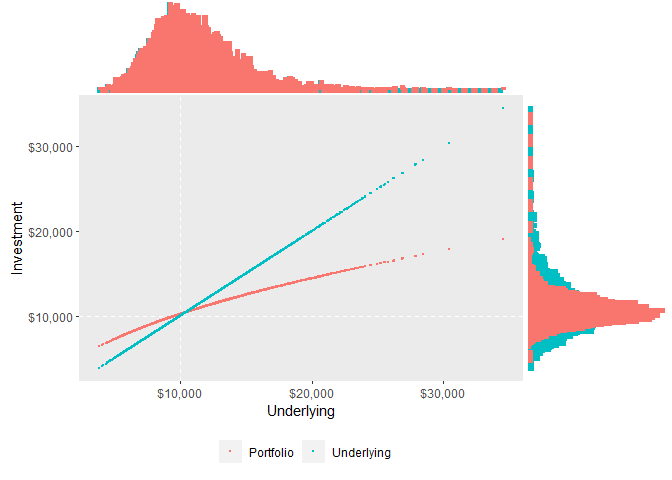
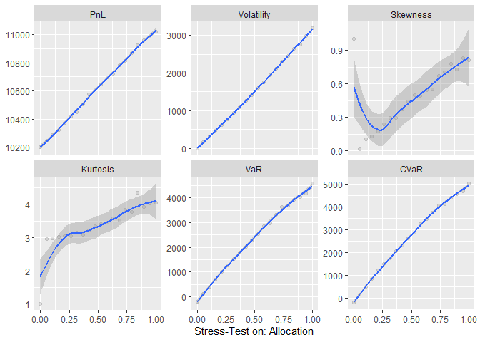

<!-- README.md is generated from README.Rmd. Please edit that file -->

# DynamicStrategies

<!-- badges: start -->

[](https://codecov.io/gh/Reckziegel/DynamicStrategies?branch=main)
[](https://github.com/Reckziegel/DynamicStrategies/actions)
[](https://lifecycle.r-lib.org/articles/stages.html#experimental)
<!-- badges: end -->

`DynamicStrategies` is currently on the development stage.

## Installation

Install the development version from github with:

``` r
# install.packages("devtools")
install.packages("DynamicStrategies")
```

## Example

``` r
library(DynamicStrategies)
library(ggplot2)

# Build a Convex Strategy
convex_strat <- simulate_strategy(strategy = "max_utility")
convex_strat
#> << Dynamic Strategy >>
#> time             : 0 0.003968254 0.007936508 ... 0.4920635 0.4960317 0.5
#> portfolio_series : 10000 9774.044 9592.819 ... 13677.28 13556.93 13785.87
#> market_series    : 10000 9546.501 9190.973 ... 17985.99 17666.63 18260.51
#> percentage_series: 0.5 0.5 0.5 ... 0.5 0.5 0.5
#> underlying_index : 18260.51 11529.34 9717.875 ... 25244.07 8463.544 12101.33
#> portfolio_value  : 13785.87 10932.21 10040.53 ... 16220.87 9410.509 11207.85
# See the main statistics
extract_stats(convex_strat)
#> # A tibble: 6 x 2
#>   stat           value
#>   <fct>          <dbl>
#> 1 PnL        10628.   
#> 2 Volatility  1505.   
#> 3 Skewness       0.479
#> 4 Kurtosis       3.51 
#> 5 VaR         2433.   
#> 6 CVaR        2736.
# See the P&L simulation
autoplot(convex_strat)
```



``` r
# Stress-Test a parameter
plot_sensivities(strategy = convex_strat, variable = "allocation", from = 0, to = 1, size = 20)
```



## References

-   Attilio Meucci (2021). Review of Dynamic Allocation Strategies
    (<https://www.mathworks.com/matlabcentral/fileexchange/28384-review-of-dynamic-allocation-strategies>),
    MATLAB Central File Exchange. Retrieved September 5, 2021.

-   Meucci, Attilio, Review of Dynamic Allocation Strategies: Utility
    Maximization, Option Replication, Insurance, Drawdown Control,
    Convex/Concave Management (July 7, 2010). Available at SSRN:
    <https://www.ssrn.com/abstract=1635982>
